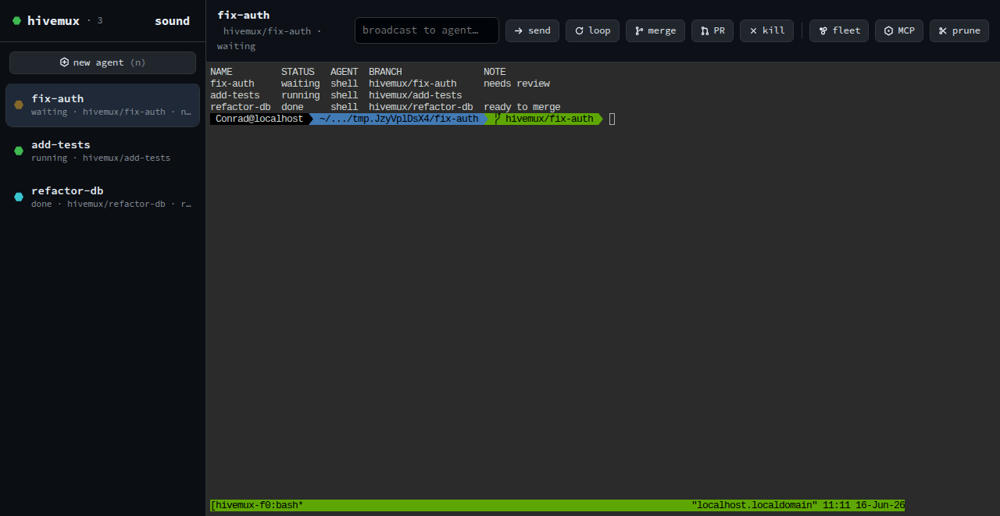
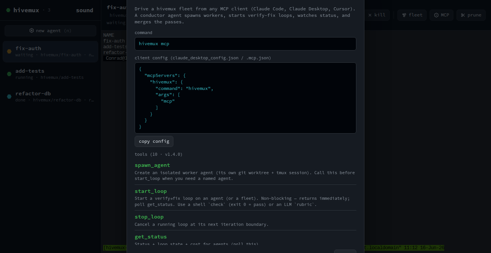
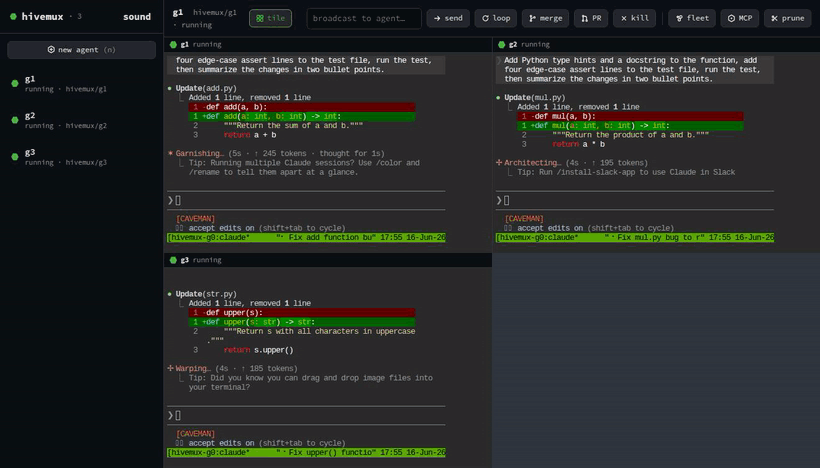

<div align="center">


**A Linux-native, tmux-backed orchestrator for parallel AI coding agents.**

[](https://github.com/Bradical247/hivemux/actions/workflows/ci.yml)
[](LICENSE)


</div>

<p align="center"></p>

<p align="center"><br/><sub>the <code>hivemux gui</code> desktop window: sidebar workspaces, embedded live terminals, and a toolbar that drives the whole feature set</sub></p>

<p align="center"><br/><sub>the in-app MCP panel: copy-paste client config and the live tool list, so a conductor agent can drive the fleet</sub></p>

<p align="center"><br/><sub>tile view: every agent's live terminal at once. A tile lights up, blinks, and chimes the moment its agent finishes</sub></p>

Run many coding agents (Claude Code, Codex, Gemini, Aider, …) at once, each in
its own isolated git worktree and tmux session, and manage them all from one
place. Because hivemux is built on tmux, it runs headless over SSH, persists
across disconnects, and lives on a remote box you attach to from anywhere.

> Inspired by [cmux](https://github.com/manaflow-ai/cmux) (macOS/Ghostty).
> hivemux trades the native GUI for what a terminal multiplexer gives you for
> free: the server room.

## Features

- 🔌 **MCP server**: `hivemux mcp` exposes the orchestration as MCP tools, so a
  conductor agent (Claude Code/Desktop, Cursor) drives a hivemux fleet
  conversationally: *"fan out 3 agents on these bugs, loop each until tests pass,
  $3 cap, merge the greens."* spawn / loop / status / merge / kill over MCP, with
  per-agent cost caps and a concurrency limit by default.
- 🔁 **Loop engineering**: `hivemux loop <name> --goal … --check "bun test"` drives an
  agent headless (one-shot per iteration) through iterate → verify → fix cycles
  until the check passes, or it hits a max-iteration or cost cap, with exact
  per-iteration cost. The verifier is a shell check or an LLM judge (`--rubric`).
  Pluggable runner (`--runner`): `claude` is built in, codex / gemini /
  OpenRouter-backed CLIs drop in via config. `--fleet N` runs the same goal on N
  agents at once; `--commit` / `--pr` land it on pass. `--ponytail` flips the agent
  into lazy-senior-dev mode (smallest solution that works), via
  [Ponytail](https://github.com/DietrichGebert/ponytail). `--watch` streams the
  agent's output (text + thinking) into its terminal pane, so you watch it reason
  live in the grid instead of staring at a headless black box.
- 🖥️ **Desktop GUI**: `hivemux gui` opens a cmux-style app window: a sidebar of agent
  workspaces (status + notification rings) and an embedded live terminal per agent
  (via [ttyd](https://github.com/tsl0922/ttyd)). The toolbar drives the full feature
  set (loop, fleet, MCP setup, merge, PR, broadcast, prune, kill), plus a loop-history
  viewer and live usage. **Tile** shows every agent's terminal at once, and a tile
  lights up, blinks, and chimes the moment its agent finishes, so you never click
  through tabs to find the one that needs you.
- 🐝 **Parallel agents, fully isolated**: each agent runs in its own git worktree
  (its own branch, no file collisions) and its own tmux session.
- 🛰️ **Headless and remote-first**: tmux-backed, so it runs over SSH on a server, the
  agents survive disconnects, and you reattach from anywhere.
- 📊 **Many ways to watch**: an `hivemux ls` table, a live TUI (`hivemux dash`), a tiled
  terminal view (`hivemux grid`), and a remote-reachable web dashboard (`hivemux web`).
- ⚠️ **Conflict detection**: surfaces files touched by more than one agent before you
  merge, in the CLI and both dashboards.
- 💰 **Usage and cost observability**: per-agent token counts, estimated cost, and
  context-window fill (`hivemux usage` and the dashboards). Anthropic rates ship
  grounded; any other LLM is priced via `~/.hivemux/config.json`. Set `--cost-cap` /
  `--ctx-cap` for a chime and a Slack/webhook alert when an agent crosses it.
- 🔀 **Merge and PR orchestration**: `hivemux merge` lands a branch (clean-aborts on
  conflict); `hivemux pr` pushes and opens a GitHub PR.
- 📣 **Broadcast**: `hivemux broadcast` types the same prompt into many agents at once.
- 🔔 **Status notifications**: agents report `waiting` / `done` / `error` via
  `hivemux notify` (wire it into agent hooks); a daemon pushes live events to every client.
- 🔒 **Authenticated when exposed**: the web dashboard auto-mints a token the moment it
  binds beyond loopback.
- 🛡️ **Sandboxed agents and governance**: looped agents run under an OS sandbox (bwrap on
  Linux, seatbelt on macOS) confined to their worktree, so a headless `acceptEdits` agent
  can't write outside it. A `policy` block governs sandbox, network, a hard cost ceiling,
  and `requireApproval` (hold commit/PR for `hivemux approve`). `hivemux doctor` checks it all.
- 📦 **Single-binary distribution**: `bun build --compile` produces one self-contained
  executable; the target machine needs nothing installed.

## Why tmux as the base

tmux already solves the hard parts: PTYs, sessions, panes, and **persistence
across disconnects**. hivemux doesn't reimplement any of it. It's a thin layer that
adds the agent-specific concerns on top:

| Concern | Who handles it |
|---|---|
| PTY / session / pane / persistence | tmux |
| Isolated working dir per agent | git worktree |
| Spawn / list / attach / kill agents | hivemux |
| Status + notifications ("agent is waiting") | hivemux + agent hooks |

## Status

**v1.4.** Working: `new`, `ls`, `attach`, `kill`, `prune`, `notify`, `agents`,
`conflicts`, `broadcast`, `merge`, `pr`, `loop` (+ fleet, detach, history), `usage`,
`dash` (live TUI), `grid` (tiled live view), `web` (dashboard + SSE + auth + create
form + loop/fleet/MCP controls), `gui` (cmux-style desktop window), `daemon`,
`watch`, `mcp` (MCP server).

New here? Read the [usage guide / runbook](docs/GUIDE.md) for task-oriented recipes.

## Commands

```
hivemux new <name> [--agent claude] [--repo .] [--branch b] [--base ref]
hivemux ls
hivemux attach <name>
hivemux kill <name> [--rm-worktree]
hivemux notify [--name n] --status waiting --note "..."
hivemux conflicts                       # files touched by >1 agent (merge collisions)
hivemux usage [--json]                  # tokens, estimated cost, context-fill per agent + total
hivemux report-usage [--name n] --model m --in N --out N --ctx N   # push usage (from agent hooks)
hivemux broadcast [names...] -m "..."   # type a prompt into agents' sessions (all if no names)
hivemux merge <name> [--into b] [--ff]  # merge an agent's branch into the base branch
hivemux pr <name> [-t title] [--draft]  # push branch + open a GitHub PR (needs gh)
hivemux loop <name> --goal "..." --check "cmd" [--rubric t] [--max N] [--fleet N] [--detach] [--commit] [--pr] [--ponytail] [--sandbox auto|on|off] [--watch]
                                     # iterate→verify→fix until the check passes (loop engineering)
hivemux loop-list / loop-stop <name> / loop-log <name>   # manage detached loops (need the daemon)
hivemux dash                            # live full-screen TUI (status table)
hivemux grid                            # tiled, read-only live view of all agents
hivemux web [--port 7878] [--host 0.0.0.0] [--token t]   # web dashboard, SSE live updates
hivemux gui [--port 7878]               # cmux-style desktop app window (needs ttyd + a browser)
hivemux daemon                          # control-plane daemon (event push, remote API)
hivemux watch                           # stream live status from the daemon
hivemux mcp                             # run as an MCP server (stdio); a conductor agent drives the fleet
hivemux agents
hivemux approve [name]                  # perform a commit/PR held by requireApproval (no name = list)
hivemux deny <name>                     # discard a held commit/PR
hivemux doctor                          # check deps (tmux, ttyd, browser, gh) + sandbox availability
```

### Drive hivemux from a conductor agent (MCP)

Add it to your MCP client once:

```bash
claude mcp add hivemux -- hivemux mcp     # or a .mcp.json entry
```

Then the top-level agent orchestrates a fleet conversationally: *"spin up agents
for the 3 TODOs, loop each until `bun test` passes, $3 cap each, merge the passes."*
Tools: `spawn_agent`, `start_loop` (non-blocking, poll `get_status`), `usage`,
`conflicts`, `merge`, `kill`, `broadcast`. Cost-capped and concurrency-limited by default.

Exposing the web dashboard beyond loopback (`--host 0.0.0.0`) auto-generates an auth
token if you don't pass `--token`; the printed URL includes it (`?token=…`), and the
API also accepts an `x-hivemux-token` header.

## Install

### Desktop app (Linux + macOS)

Grab from [Releases](https://github.com/Bradical247/hivemux/releases/latest):
- **Linux**: `*.AppImage` or `*.deb`
- **macOS**: `*.dmg` (Apple Silicon; unsigned, right-click → Open the first time)
- **CLI-only**: the raw `hivemux-linux-x64` / `hivemux-macos-arm64` binaries

Desktop installers bundle `hivemux` + `ttyd`. Built by CI on each tagged release.

### CLI / from source

```bash
git clone https://github.com/Bradical247/hivemux && cd hivemux
bun install
bun run build      # compiles a single standalone binary -> dist/hivemux
```

`bun run build` produces a self-contained executable (the Bun runtime is embedded),
so the target machine needs **nothing installed** to run it; copy `dist/hivemux` to a
server and go.

Requires (build/dev): [Bun](https://bun.sh) `>= 1.1`, `tmux >= 3.2`, `git`, plus
whatever agent CLIs you drive. Dev without building: `bun src/cli.ts <args>`.

## Quickstart

```bash
cd ~/your-repo

hivemux new fix-auth                 # worktree + tmux session, launches `claude`
hivemux new add-tests --agent aider  # a second agent, isolated from the first
hivemux ls                           # see them all + status
hivemux attach fix-auth              # drop into one
# Ctrl-b d to detach; the agent keeps running
hivemux kill fix-auth --rm-worktree  # tear it down
```

### Status notifications (cmux-style "waiting" signal)

Each session gets `$HIVEMUX_NAME` in its env. Wire your agent's hooks to report
back, so `hivemux ls` shows when an agent is blocked on you:

```bash
# e.g. a Claude Code Stop hook:
hivemux notify --status waiting --note "needs review"
```

## Configuration

`~/.hivemux/config.json` to add or override agent adapters:

```json
{
  "agents": {
    "claude-yolo": { "cmd": "claude --dangerously-skip-permissions" }
  },
  "runners": {
    "gemini": { "bin": "gemini", "args": ["-p", "{prompt}"], "parse": "text" },
    "codex":  { "bin": "codex", "args": ["exec", "{prompt}"], "parse": "text" }
  },
  "pricing": {
    "gpt-5": { "in": 1.25, "out": 10, "context": 400000 }
  },
  "integrations": {
    "slackWebhook": "https://hooks.slack.com/services/…",
    "webhook": "https://example.com/hivemux"
  },
  "policy": {
    "sandbox": "auto",
    "network": true,
    "maxCostUSD": 5,
    "requireApproval": false
  }
}
```

`pricing` rates are USD per 1M tokens (`cacheRead`/`cacheWrite` optional, default to
0.1× / 1.25× of `in`); built-in Anthropic models are grounded and need no entry; add
entries for any other LLM you run. `integrations` receive cap-crossing alerts.

`policy` governs what looped agents may do: `sandbox` (`auto` / `on` / `off`) runs the
agent under an OS sandbox (bwrap on Linux, seatbelt on macOS) confined to its worktree;
`network` toggles network inside it; `maxCostUSD` is a hard cost ceiling; `requireApproval`
holds any commit/PR for `hivemux approve`. Run `hivemux doctor` to see what's installed.

State lives in `~/.hivemux/state.json`; worktrees in `~/.hivemux/worktrees/<repo>/<name>`.

## Roadmap

- [x] **`hivemux dash`**: live TUI dashboard driven by the shared watcher.
- [x] **Web dashboard**: remote-accessible UI + SSE; the cmux experience, reachable from anywhere.
- [x] **Conflict detection**: flag files touched by more than one agent before you merge.
- [x] **Socket/JSON API**: daemon control plane with event push (cmux parity).
- [x] **Merge/PR orchestration**: `hivemux merge` (clean-abort on conflict) and `hivemux pr` (push + `gh pr create`).
- [x] **`hivemux broadcast`**: send the same instruction to N agents at once.
- [x] **Loop engineering**: `hivemux loop` (iterate→verify→fix; shell or LLM-judge verifier; fleet loops; cost/ctx-capped).
- [x] **Web auth**: token required (auto-minted) whenever the dashboard binds beyond loopback.
- [x] **Single-binary distribution**: `bun build --compile` ships a self-contained executable.
- [x] **TUI: tiled live agent panes**: `hivemux grid` mirrors every live agent in a tiled, read-only view.
- [x] **Web: create-agent form**: spawn agents from the dashboard.
- [x] **Usage / cost / context observability**: `hivemux usage`, multi-LLM pricing, caps + Slack/webhook alerts.
- [ ] **Go rewrite**: only if Bun's single-binary story proves insufficient.

## Architecture

Layered: one core, many frontends. No frontend touches tmux/git/store directly.

```
src/
  core/
    manager.ts   - the single orchestration API (create/list/kill/notify/conflicts)
    tmux.ts      - async wrapper over the tmux CLI
    git.ts       - worktrees + changed-file detection
    store.ts     - ~/.hivemux/state.json, atomic writes + cross-process lock
    watcher.ts   - shared poll loop → "tick"/"change"/"remove" events
    agents.ts    - pluggable agent adapters
    types.ts
  ipc/           - Unix-socket JSON daemon (server) + client + protocol
  tui/dash.ts    - zero-dep ANSI TUI over the watcher
  web/           - node:http + SSE dashboard (server + inlined page)
  cli.ts         - thin frontend over core
```

The store is the single source of truth (concurrency-safe), so CLI / daemon / web
never diverge. The daemon and web server each run a `Watcher` and push deltas to
their clients, with no per-client tmux polling.

## Credits

- [cmux](https://github.com/manaflow-ai/cmux) for the parallel-agent workflow that inspired this.
- [Ponytail](https://github.com/DietrichGebert/ponytail) by Dietrich Gebert (MIT) for the lazy-senior-dev directive behind `--ponytail`.
- [tmux](https://github.com/tmux/tmux) and [ttyd](https://github.com/tsl0922/ttyd), which do the heavy lifting.

## License

MIT
